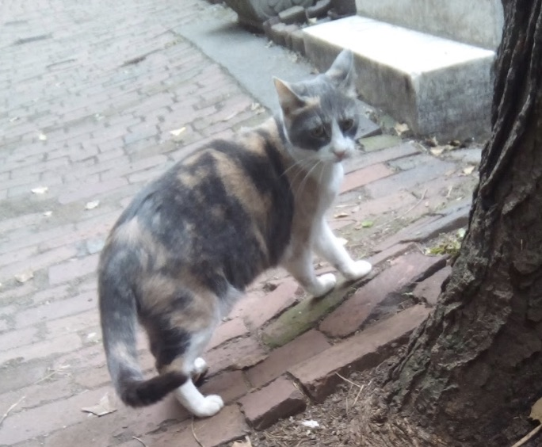
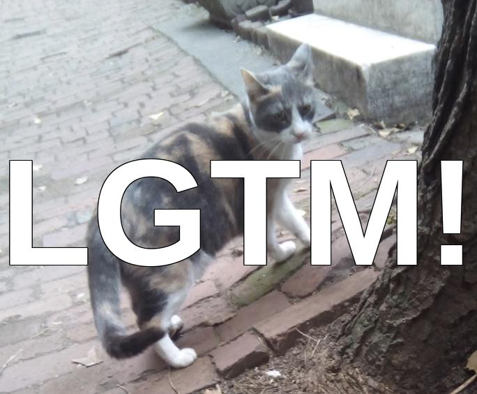
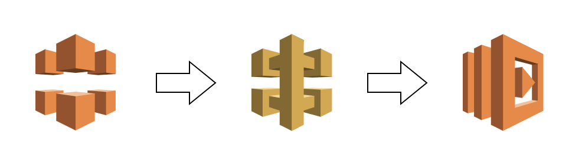

# calgtm
Generate LGTM image by uploaded image file. You can generate LGTM image by passing your image url to calgtm.

## Usage

Specify image file url to follow url's query parameter as `img`.

http://calgtm.inabajun.work/?img=http://example.com/yourimage.jpg

### Sample

Original(http://example.com/cat)



After LGTM(http://calgtm.inabajun.work/?img=http://example.com/cat)




## Build
### Prepare for first build
```
docker build -t mylambda .
```
### Build command
```
docker run -v "$PWD":/var/task mylambda
```
This command create deploy_package.zip.

## Constitution


## Deploy
### AWS Lambda
Upload deploy_package.zip to AWS Lambda.

### API Gateway
Lambda ploxy integration and specify binary media type for Content-Type image/jpeg.

### CloudFront
Add follow headers by CloudFront.

| key | value |
----|---- 
| Accept | image/jpeg |
| Content-Type | image/jpeg |
